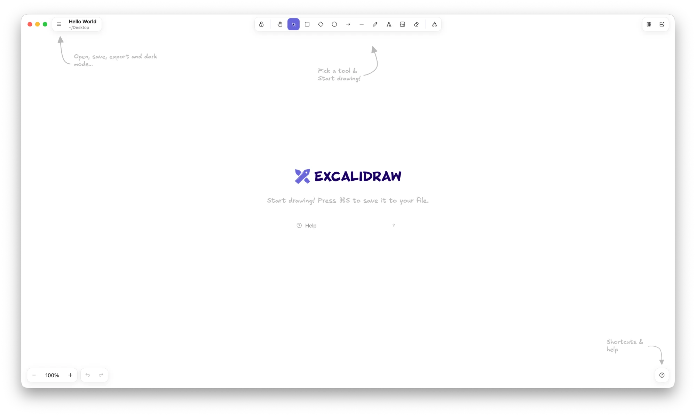

# Excalidraw for Mac

**English** · [繁體中文](README.zh-TW.md)

**An offline Excalidraw whiteboard for macOS, with a built-in MCP server so AI agents can draw with you.**

[](LICENSE)
[](#install)
[](#install)
[](#let-an-ai-agent-use-it-mcp)
[](https://github.com/TingGeorge/excalidraw-mac/releases/latest)

<p align="center">
  
</p>

A native macOS app built around [Excalidraw](https://github.com/excalidraw/excalidraw), with a built-in [MCP](https://modelcontextprotocol.io) server so AI agents such as Claude Code can draw in it.

> **Unofficial.** This is an independent project. It is not made by, endorsed by or affiliated with the Excalidraw team. "Excalidraw" is the name of their project, used here to say what this app is built on.

- **Fully offline.** Excalidraw, its hand-drawn fonts (including a hand-drawn Chinese font) and the Mermaid converter are all inside the app.
- **Light.** A native Swift app on macOS's own WebKit (the engine Safari uses) — no bundled Chromium. About 25 MB (a 17 MB download).
- **File first.** Create a `.excalidraw` file in a folder you choose (or open one) and draw in it. Nothing is written to it until you press ⌘S.
- **Built-in MCP server.** Agents can read, draw and edit in the file you have open while you watch; every step can be undone with ⌘Z. Only you save.
- **At home on macOS.** Title bar tools, native menus (Edit, View, Settings ⌘,), light / dark / system appearance, keyboard shortcuts shown the Mac way, English and Chinese UI.

---

## Install

1. Download **`Excalidraw-macOS.zip`** from the **[latest release](https://github.com/TingGeorge/excalidraw-mac/releases/latest)** (universal: Apple Silicon and Intel; macOS 13 or later).
2. Unzip it and drag **Excalidraw.app** into **Applications**.
3. **First launch:** the app is not notarized by Apple, so macOS blocks a plain double-click. Any one of these lets it open:
   - Right-click Excalidraw in Applications → **Open** → **Open**.
   - macOS 15 and later: double-click once, then **System Settings → Privacy & Security** → scroll down to Excalidraw → **Open Anyway**.
   - Or in Terminal: `xattr -dr com.apple.quarantine /Applications/Excalidraw.app`

To build it yourself you need Node 20+ and Xcode: run `./scripts/build-app.sh`; the app and the zip end up in `build/`.

## Everyday use

1. **The start screen** offers **New File…** (pick a folder and a name; the file is created right away), **Open…**, and your recent files. You can also double-click `.excalidraw` files in Finder.
2. **Draw.** You and your agent edit the same canvas. The title bar shows the file name; "Edited" means there are unsaved changes.
3. **Save with ⌘S** — back into the file you chose. Agents can't save.
4. **Closing the window** returns to the start screen and asks about unsaved changes (so does ⌘Q).

| To… | Use |
|---|---|
| New / open a file | ⌘N / ⌘O |
| Save / save as | ⌘S / ⇧⌘S |
| Export an image | ⇧⌘E, **File › Export Image…** or the export button (top right): preview, PNG / SVG / copy, background, dark, selection only. Named after your file. |
| Undo, copy, paste | ⌘Z / ⌘C / ⌘V or the **Edit** menu (the canvas, or the text you're typing) |
| Zoom, dark mode, library | **View** menu, or Excalidraw's ☰ menu |
| Appearance (system / light / dark) | **Excalidraw › Settings…** (⌘,) |
| Find any command | ⌘/ (command palette) |

- **Crash safety:** while you edit, the app keeps a recovery copy in its own folder (never in your file). If it quits unexpectedly, reopening the file brings the unsaved changes back; press ⌘S to keep them.
- The interface follows your system language.
- The network is only used if you choose to: browsing the online libraries (libraries.excalidraw.com) or embedding web pages such as YouTube in a drawing. Downloaded `.excalidrawlib` files can be imported and work offline.

The app's own data (recent files, library, recovery copy) lives in `~/Library/Application Support/Excalidraw/`.

## Let an AI agent use it (MCP)

The MCP server ships inside the app: `/Applications/Excalidraw.app/Contents/MacOS/excalidraw-mcp`. Nothing else to install. It starts the app when needed; if no file is open, the agent is told to ask you to create or open one.

The quickest way: in the app, **Excalidraw › Connect an AI Agent (MCP)…** and copy the setup.

**Claude Code** — run once in Terminal:

```bash
claude mcp add excalidraw --scope user -- /Applications/Excalidraw.app/Contents/MacOS/excalidraw-mcp
```

**Other MCP clients** (Claude Desktop, Cursor, Codex, …) — add to their MCP settings:

```json
{
  "mcpServers": {
    "excalidraw": { "command": "/Applications/Excalidraw.app/Contents/MacOS/excalidraw-mcp" }
  }
}
```

Then, with a file open in the app, try:

- "Draw this project's architecture in my open Excalidraw file."
- "Make the boxes I selected green and add an arrow from API to DB."
- "Read the flowchart on the canvas and add the missing error-handling branches."
- "Draw this Mermaid diagram in Excalidraw."

### Tools

| Tool | What it does |
|---|---|
| `get_scene` | Reads the canvas: each element's id, position, size, text, colours and arrow connections; the selection; the open file; unsaved changes |
| `add_elements` | Adds rectangles, ellipses, diamonds, text, arrows, lines and frames. Arrows can connect elements by id; they are routed edge to edge and stay attached |
| `add_mermaid` | Turns Mermaid (flowchart, sequence, class diagrams) into editable Excalidraw shapes, laid out automatically |
| `update_elements` | Moves, resizes, re-labels and restyles elements by id; labels and connected arrows follow |
| `delete_elements` | Deletes elements by id |
| `clear_canvas` | Clears the canvas (⌘Z brings it back) |
| `render_image` | Returns a PNG of the drawing to the agent so it can check its work; writes no files |
| `zoom_to_fit` | Scrolls and zooms your window to show everything |

**What agents can't do:** save, open, save as or export files, or read or write anything on your Mac. They only edit the canvas you have open, and every change can be undone.

## Uninstall

1. Quit the app and move Excalidraw from Applications to the Trash.
2. Optional — remove its data: `rm -rf ~/Library/Application\ Support/Excalidraw`
3. Optional — remove the MCP setup: `claude mcp remove excalidraw --scope user`

---

## For developers

```
web/                      the Excalidraw page (React + Vite), bundled into the app
  src/bridge.ts           operations the app and agents can call
  src/App.tsx             Excalidraw, menus, autosave, unsaved state
  scripts/third-party.mjs third-party notices, generated from the bundle
  licenses/               license texts for things that don't ship their own
  test/                   page tests (headless Chromium), MCP end-to-end, real-app UI tests
mac/                      Swift package
  Sources/ExcalidrawApp   the AppKit + WKWebView shell
  Sources/ExcalidrawMCP   the MCP server (stdio, JSON-RPC)
  Sources/BridgeCore      shared: Unix socket, JSON, paths
scripts/build-app.sh      builds the universal Excalidraw.app and its zip
```

```
AI agent ──stdio──▶ excalidraw-mcp ──Unix socket──▶ Excalidraw.app ──WKWebView──▶ window.excalidrawBridge
(Claude Code)       (inside the app)   bridge.sock     (Swift)       callAsyncJavaScript   (Excalidraw API)
```

- The page is served from the app's own `excalidraw://app/` URL scheme (`Contents/Resources/web/`), fonts included — no network needed.
- `bridge.sock` lives in `~/Library/Application Support/Excalidraw/` (folder 0700, socket 0600): only your own processes can connect.
- Agents can only call canvas operations. With no file open the app refuses them all, and neither the MCP server nor the app offers any way to open, save or write files.

Local development:

```bash
cd web && npm ci && npm run build
npm test                                   # page operations, offline, fonts (needs Chromium)
cd ../mac && swift build -c release        # on Linux only the MCP server builds
cd ../web && MCP_BIN=../mac/.build/release/excalidraw-mcp node --test test/mcp.test.mjs
```

On Linux, `test/fake-app.mjs` stands in for the app (same socket protocol, operations run in the real page in headless Chromium), so the MCP server can be tested without a Mac. GitHub Actions builds the real app on macOS 15 and macOS 26, runs the same flow against it (user opens a file → agent draws → user presses ⌘S), clicks through the UI with real mouse and menu events, checks recovery after a forced quit. Pushing a version tag (`git tag v0.2.0 && git push origin v0.2.0`) publishes that build as the latest release once the tests pass on every macOS.

## License

This project is released under the [MIT License](LICENSE) — © 2026 TingGeorge.

It bundles [Excalidraw](https://github.com/excalidraw/excalidraw) (MIT), its fonts (SIL Open Font License 1.1 and MIT) and other open-source packages, each under its own license. The full list with every license text is in [THIRD_PARTY_NOTICES.md](THIRD_PARTY_NOTICES.md), generated from what the app actually ships, and in the app under **Help › Acknowledgements**.
